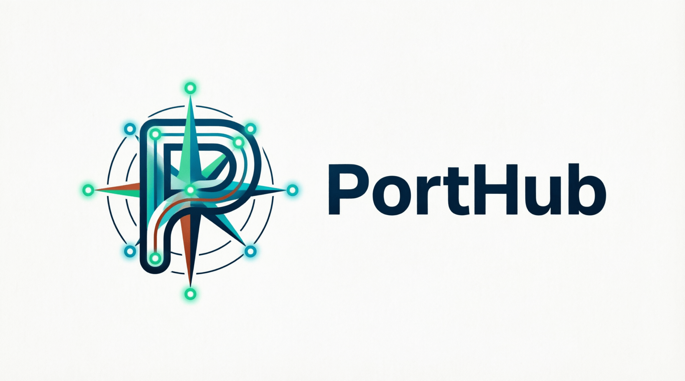

# PortHub



PortHub is a desktop bookmark manager built with Tauri, SvelteKit, and shadcn-svelte.

It organizes links into spaces and groups, making it easier to keep work, personal, and project resources separated.

## Features

- Spaces with nested link groups.
- Search across spaces, groups, links, descriptions, and tags.
- Compact link cards with favicon, title, URL, description, tags, and quick actions.
- Create, edit, and delete groups and links.
- JSON export and import.
- Light and dark themes.
- English and Russian interface language.

## Development

Install dependencies:

```bash
npm install
```

Run the web dev server:

```bash
npm run dev
```

Run the Tauri desktop app:

```bash
npm run tauri dev
```

Check and build:

```bash
npm run check
npm run build
```

## License

[MIT](LICENSE)
